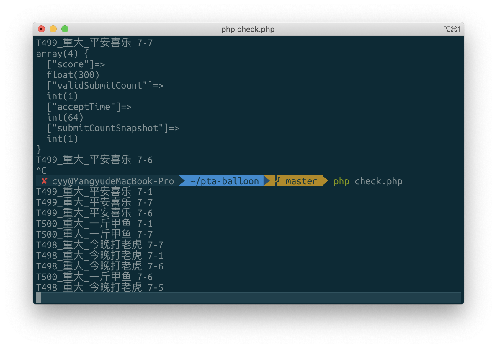

# pta-balloon

## 1. 简介

用于PTA的气球小工具，CCPC竞赛当学生教练期间为了发气球写的。

## 2. 环境准备

对于Debian/Ubuntu系统（Windows Subsystem for Linux也可以）：

```
apt install php-mbstring php-cli curl
```

## 3. 使用方法

1. 打开Chrome浏览器，使用教练号登录PTA，进入对应比赛查看排名。

2. 进入审查元素，然后切换到排名的第二页，再回到第一页，在对应的网络请求上Copy as curl，然后放入curl_cmd.txt。

   
   
   注：在Windows下此处有两个选项，若直接在Windows下使用php与curl，应使用(cmd)，如果整个运行环境在WSL或Linux中，应使用(bash)。

3. 修改check.php，$team_key修改为对应学校昵称。

4. 在当前文件夹执行php check.php，看输出即可。

   
