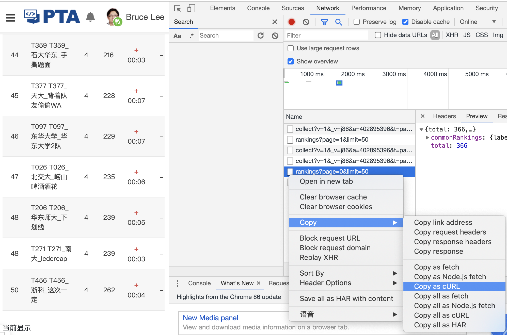

# pta-bloon

## 1. 简介

用于PTA的气球小工具，CCPC竞赛当学生教练期间为了发气球写的。

## 2. 使用方法

1. 打开Chrome浏览器，使用教练号登录PTA，进入对应比赛查看排名。

2. 进入审查元素，然后切换到排名的第二页，再回到第一页，在对应的网络请求上Copy as curl。

   

3. 修改check.php，$team_key修改为对应学校昵称。

4. 在当前文件夹执行php check.php，看输出即可。